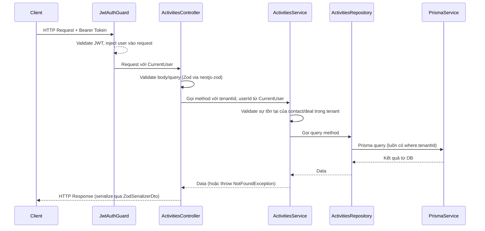
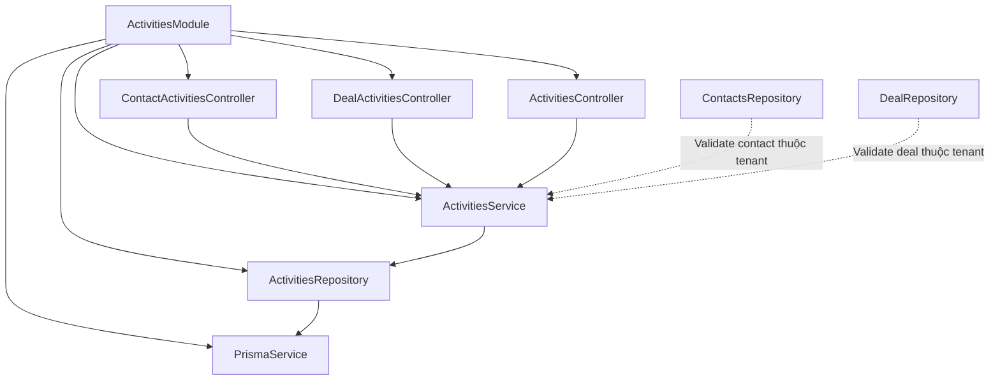

# Thiết kế: Activities

## Overview

Module **Activities** mở rộng toàn diện khả năng ghi nhận và quản lý hoạt động bán hàng trong CRM SaaS multi-tenant. Module cho phép sales rep log các hoạt động loại `CALL`, `EMAIL`, `MEETING`, `NOTE` gắn với contact hoặc deal, xem lịch sử tương tác đầy đủ, cập nhật/xóa activity, và kết nối frontend từ mock data sang API thực.

Module được xây dựng theo đúng pattern của dự án: `controller → service → repo → model → dto → module`, với multi-tenant isolation bắt buộc qua `tenantId` lấy từ JWT.

### Phạm vi

- Tạo activity gắn với contact (`POST /contacts/:contactId/activities`)
- Tạo activity gắn với deal (`POST /deals/:dealId/activities`)
- Xem activities theo contact (`GET /contacts/:contactId/activities`)
- Xem activities theo deal (`GET /deals/:dealId/activities`)
- Xem tất cả activities của tenant, có phân trang và lọc (`GET /activities`)
- Cập nhật activity (`PATCH /activities/:id`)
- Xóa activity (`DELETE /activities/:id`)
- Frontend: Activities page, ActivityCard, ActivityForm, SummaryPanel, ActivityTimeline
- Tích hợp vào Contact Detail Page và Deal Detail Page

---

## Architecture

### Luồng xử lý request



### Cấu trúc module

```
be/src/routes/activities/
├── activities.controller.ts   # HTTP endpoints — 3 controller classes
├── activities.service.ts      # Business logic, validate contact/deal
├── activities.repo.ts         # Prisma queries, luôn filter tenantId
├── activities.model.ts        # Zod schemas + TypeScript types
├── activities.dto.ts          # DTO classes (createZodDto wrappers)
└── activities.module.ts       # NestJS module declaration
```

### Vị trí trong hệ thống



---

## Components and Interfaces

### Controller Design — Ba Controller Classes

Module sử dụng **ba controller classes riêng biệt** trong cùng file `activities.controller.ts`, đây là pattern NestJS chuẩn để xử lý các route prefix khác nhau. Cả ba đều được đăng ký trong `ActivitiesModule`.

#### ContactActivitiesController

```typescript
@Controller('contacts/:contactId/activities')
@UseGuards(JwtAuthGuard)
export class ContactActivitiesController {
  // POST /contacts/:contactId/activities
  @Post()
  @ZodSerializerDto(CreateActivityResDto)
  createActivity(
    @CurrentUser() user: AccessTokenPayload,
    @Param('contactId') contactId: string,
    @Body() body: CreateActivityForContactBodyDto,
  )

  // GET /contacts/:contactId/activities
  @Get()
  @ZodSerializerDto(GetActivitiesResDto)
  getActivities(
    @CurrentUser() user: AccessTokenPayload,
    @Param('contactId') contactId: string,
  )
}
```

#### DealActivitiesController

```typescript
@Controller('deals/:dealId/activities')
@UseGuards(JwtAuthGuard)
export class DealActivitiesController {
  // POST /deals/:dealId/activities
  @Post()
  @ZodSerializerDto(CreateActivityResDto)
  createActivity(
    @CurrentUser() user: AccessTokenPayload,
    @Param('dealId') dealId: string,
    @Body() body: CreateActivityForDealBodyDto,
  )

  // GET /deals/:dealId/activities
  @Get()
  @ZodSerializerDto(GetActivitiesResDto)
  getActivities(
    @CurrentUser() user: AccessTokenPayload,
    @Param('dealId') dealId: string,
  )
}
```

#### ActivitiesController

```typescript
@Controller('activities')
@UseGuards(JwtAuthGuard)
export class ActivitiesController {
  // GET /activities?page=1&limit=20&type=CALL&search=...&contactId=...&dealId=...
  @Get()
  @ZodSerializerDto(GetActivitiesPaginatedResDto)
  getAll(
    @CurrentUser() user: AccessTokenPayload,
    @Query() query: GetActivitiesQueryDto,
  )

  // PATCH /activities/:id
  @Patch(':id')
  @ZodSerializerDto(ActivityResDto)
  updateActivity(
    @CurrentUser() user: AccessTokenPayload,
    @Param('id') activityId: string,
    @Body() body: UpdateActivityBodyDto,
  )

  // DELETE /activities/:id
  @Delete(':id')
  @ZodSerializerDto(MessageDto)
  deleteActivity(
    @CurrentUser() user: AccessTokenPayload,
    @Param('id') activityId: string,
  )
}
```

**Lưu ý quan trọng về thứ tự route**: Route `GET /activities` (không có param) phải được khai báo **trước** `PATCH /activities/:id` và `DELETE /activities/:id` để NestJS match đúng. Trong cùng một controller class, thứ tự decorator quyết định thứ tự match.

### ActivitiesService

Chứa business logic: validate sự tồn tại của contact/deal trong đúng tenant, đảm bảo tenantId và userId luôn đến từ JWT.

```typescript
@Injectable()
export class ActivitiesService {
  constructor(
    private readonly activitiesRepo: ActivitiesRepository,
    private readonly contactsRepo: ContactsRepository,
    private readonly dealRepo: DealRepository,
  ) {}

  // Tạo activity cho contact — validate contact thuộc tenant trước
  async createForContact(
    tenantId: string,
    contactId: string,
    userId: string,
    body: CreateActivityForContactBodyType,
  ): Promise<ActivityWithRelations>;

  // Tạo activity cho deal — validate deal thuộc tenant trước
  // Nếu body có contactId, cũng validate contact thuộc tenant
  async createForDeal(
    tenantId: string,
    dealId: string,
    userId: string,
    body: CreateActivityForDealBodyType,
  ): Promise<ActivityWithRelations>;

  // Lấy activities theo contact — validate contact trước
  async getByContact(
    tenantId: string,
    contactId: string,
  ): Promise<{ data: ActivityWithRelations[] }>;

  // Lấy activities theo deal — validate deal trước; không return empty list khi deal không tồn tại
  async getByDeal(
    tenantId: string,
    dealId: string,
  ): Promise<{ data: ActivityWithRelations[] }>;

  // Lấy tất cả activities của tenant, phân trang và lọc
  async getAll(
    tenantId: string,
    query: GetActivitiesQueryType,
  ): Promise<GetActivitiesPaginatedResType>;

  // Partial update — chỉ update fields được cung cấp
  async updateActivity(
    activityId: string,
    tenantId: string,
    body: UpdateActivityBodyType,
  ): Promise<ActivityWithRelations>;

  // Hard delete — không phải soft delete
  async deleteActivity(
    activityId: string,
    tenantId: string,
  ): Promise<{ message: string }>;
}
```

**Lưu ý nghiệp vụ quan trọng**:

- `getByDeal`: khi `dealId` không tồn tại trong tenant, throw `NotFoundException` thay vì trả về `{ data: [] }`.
- `deleteActivity`: sử dụng **hard delete** (`prisma.activity.delete`), không phải soft delete (Activity không có field `deletedAt`).
- `tenantId` và `userId` luôn lấy từ `CurrentUser`, không bao giờ từ request body.

### ActivitiesRepository

Thực hiện Prisma queries. **Mọi query đều phải có `where.tenantId`**.

```typescript
@Injectable()
export class ActivitiesRepository {
  constructor(private readonly prisma: PrismaService) {}

  // Tạo activity (cho cả contact và deal)
  create(
    tenantId: string,
    userId: string,
    data: CreateActivityForContactBodyType | CreateActivityForDealBodyType,
    context: { contactId?: string; dealId?: string },
  ): Promise<ActivityWithRelations>;

  // Lấy activities theo contactId
  findAllByContact(
    tenantId: string,
    contactId: string,
  ): Promise<ActivityWithRelations[]>;

  // Lấy activities theo dealId, có tiebreaker id
  findAllByDeal(
    tenantId: string,
    dealId: string,
  ): Promise<ActivityWithRelations[]>;

  // Lấy tất cả với phân trang và lọc
  findAll(
    tenantId: string,
    query: GetActivitiesQueryType,
  ): Promise<{ data: ActivityWithRelations[]; total: number }>;

  // Tìm một activity theo id + tenantId
  findOne(
    activityId: string,
    tenantId: string,
  ): Promise<ActivityWithRelations | null>;

  // Partial update
  update(
    activityId: string,
    tenantId: string,
    data: UpdateActivityBodyType,
  ): Promise<ActivityWithRelations>;

  // Hard delete
  hardDelete(activityId: string, tenantId: string): Promise<void>;
}
```

---

## Data Models

### Prisma Schema (đã có sẵn)

Model `Activity` trong `schema.prisma` đã đầy đủ và không cần migration:

```prisma
model Activity {
  id        String       @id @default(cuid())
  tenantId  String
  contactId String?
  dealId    String?
  userId    String
  title     String?
  type      ActivityType
  note      String
  date      DateTime     @default(now())

  tenant  Tenant   @relation(fields: [tenantId], references: [id])
  contact Contact? @relation(fields: [contactId], references: [id])
  deal    Deal?    @relation(fields: [dealId], references: [id])
  user    User     @relation(fields: [userId], references: [id])

  @@index([tenantId, contactId])
  @@index([tenantId, dealId])
}
```

**Lưu ý**: Activity không có `deletedAt` — xóa là **hard delete**.

### Zod Schemas (`activities.model.ts`)

```typescript
import { z } from "zod";
import { ActivityType } from "generated/prisma-client";

// ─── ENUM ───────────────────────────────────────────────────────────────────
export const ActivityTypeEnum = z.nativeEnum(ActivityType);

// ─── ENRICHED ACTIVITY (response shape với relations) ───────────────────────
// ActivityBaseSchema — dùng cho mọi response trả về client
export const ActivityBaseSchema = z.object({
  id: z.string(),
  tenantId: z.string(),
  contactId: z.string().nullable(),
  dealId: z.string().nullable(),
  userId: z.string(),
  title: z.string().nullable(),
  type: ActivityTypeEnum,
  note: z.string(),
  date: z.coerce.date(),
  user: z.object({
    id: z.string(),
    name: z.string(),
  }),
  contact: z
    .object({
      id: z.string(),
      name: z.string(),
      company: z.string().nullable(),
    })
    .nullable(),
  deal: z
    .object({
      id: z.string(),
      title: z.string(),
    })
    .nullable(),
});

export type ActivityBaseType = z.infer<typeof ActivityBaseSchema>;

// ─── CREATE FOR CONTACT ──────────────────────────────────────────────────────
// POST /contacts/:contactId/activities
export const CreateActivityForContactBodySchema = z
  .object({
    type: ActivityTypeEnum,
    title: z.string().optional().nullable(),
    note: z.string().min(1, "Nội dung không được để trống"),
    date: z.coerce.date().optional(),
  })
  .strict();

export type CreateActivityForContactBodyType = z.infer<
  typeof CreateActivityForContactBodySchema
>;

// ─── CREATE FOR DEAL ─────────────────────────────────────────────────────────
// POST /deals/:dealId/activities
export const CreateActivityForDealBodySchema = z
  .object({
    type: ActivityTypeEnum,
    title: z.string().optional().nullable(),
    note: z.string().min(1, "Nội dung không được để trống"),
    date: z.coerce.date().optional(),
    contactId: z.string().optional(), // optional — có thể gắn thêm contact
  })
  .strict();

export type CreateActivityForDealBodyType = z.infer<
  typeof CreateActivityForDealBodySchema
>;

// ─── UPDATE ──────────────────────────────────────────────────────────────────
// PATCH /activities/:id — partial, ít nhất 1 field
export const UpdateActivityBodySchema = z
  .object({
    type: ActivityTypeEnum.optional(),
    title: z.string().optional().nullable(),
    note: z.string().min(1).optional(),
    date: z.coerce.date().optional(),
  })
  .strict()
  .refine((data) => Object.keys(data).length > 0, {
    message: "Ít nhất phải có một trường được cập nhật",
  });

export type UpdateActivityBodyType = z.infer<typeof UpdateActivityBodySchema>;

// ─── GET ACTIVITIES QUERY ────────────────────────────────────────────────────
// GET /activities?page=1&limit=20&type=CALL&search=...&contactId=...&dealId=...
export const GetActivitiesQuerySchema = z.object({
  page: z.coerce.number().int().min(1).default(1),
  limit: z.coerce.number().int().min(1).max(100).default(20),
  type: ActivityTypeEnum.optional(),
  search: z.string().optional(),
  contactId: z.string().optional(),
  dealId: z.string().optional(),
});

export type GetActivitiesQueryType = z.infer<typeof GetActivitiesQuerySchema>;

// ─── RESPONSE SCHEMAS ────────────────────────────────────────────────────────
// Single activity response (CREATE + PATCH)
export const ActivityResSchema = ActivityBaseSchema;

// List response (GET /contacts/:id/activities, GET /deals/:id/activities)
export const GetActivitiesResSchema = z.object({
  data: z.array(ActivityBaseSchema),
});

// Paginated list response (GET /activities)
export const GetActivitiesPaginatedResSchema = z.object({
  data: z.array(ActivityBaseSchema),
  total: z.number().int().nonnegative(),
  page: z.number().int().positive(),
  limit: z.number().int().positive(),
});

export type GetActivitiesResType = z.infer<typeof GetActivitiesResSchema>;
export type GetActivitiesPaginatedResType = z.infer<
  typeof GetActivitiesPaginatedResSchema
>;
```

### DTOs (`activities.dto.ts`)

```typescript
import { createZodDto } from "nestjs-zod";
import {
  CreateActivityForContactBodySchema,
  CreateActivityForDealBodySchema,
  UpdateActivityBodySchema,
  GetActivitiesQuerySchema,
  ActivityResSchema,
  GetActivitiesResSchema,
  GetActivitiesPaginatedResSchema,
} from "./activities.model";

export class CreateActivityForContactBodyDto extends createZodDto(
  CreateActivityForContactBodySchema,
) {}

export class CreateActivityForDealBodyDto extends createZodDto(
  CreateActivityForDealBodySchema,
) {}

export class UpdateActivityBodyDto extends createZodDto(
  UpdateActivityBodySchema,
) {}

export class GetActivitiesQueryDto extends createZodDto(
  GetActivitiesQuerySchema,
) {}

export class ActivityResDto extends createZodDto(ActivityResSchema) {}

export class GetActivitiesResDto extends createZodDto(GetActivitiesResSchema) {}

export class GetActivitiesPaginatedResDto extends createZodDto(
  GetActivitiesPaginatedResSchema,
) {}
```

**Lưu ý**: `CreateActivityResDto` cũ trong code hiện tại được thay thế bằng `ActivityResDto` (dùng chung cho cả create và update).

### Prisma Queries chi tiết (`activities.repo.ts`)

**`create`** — dùng chung cho cả contact và deal:

```typescript
this.prisma.activity.create({
  data: {
    tenantId,
    userId,
    type: data.type,
    note: data.note,
    title: data.title ?? null,
    date: data.date ?? new Date(),
    contactId: context.contactId ?? null,
    dealId: context.dealId ?? null,
  },
  include: {
    user: { select: { id: true, name: true } },
    contact: { select: { id: true, name: true, company: true } },
    deal: { select: { id: true, title: true } },
  },
});
```

**`findAllByContact`** — ordered by date desc:

```typescript
this.prisma.activity.findMany({
  where: { tenantId, contactId },
  orderBy: { date: "desc" },
  include: {
    user: { select: { id: true, name: true } },
    contact: { select: { id: true, name: true, company: true } },
    deal: { select: { id: true, title: true } },
  },
});
```

**`findAllByDeal`** — date desc + id desc làm tiebreaker:

```typescript
this.prisma.activity.findMany({
  where: { tenantId, dealId },
  orderBy: [{ date: "desc" }, { id: "desc" }],
  include: {
    user: { select: { id: true, name: true } },
    contact: { select: { id: true, name: true, company: true } },
    deal: { select: { id: true, title: true } },
  },
});
```

**`findAll`** — pagination + filters:

```typescript
const where = {
  tenantId,
  ...(query.type && { type: query.type }),
  ...(query.contactId && { contactId: query.contactId }),
  ...(query.dealId && { dealId: query.dealId }),
  ...(query.search && {
    OR: [
      { title: { contains: query.search, mode: "insensitive" } },
      { note: { contains: query.search, mode: "insensitive" } },
    ],
  }),
};

const [data, total] = await this.prisma.$transaction([
  this.prisma.activity.findMany({
    where,
    skip: (query.page - 1) * query.limit,
    take: query.limit,
    orderBy: [{ date: "desc" }, { id: "desc" }],
    include: {
      user: { select: { id: true, name: true } },
      contact: { select: { id: true, name: true, company: true } },
      deal: { select: { id: true, title: true } },
    },
  }),
  this.prisma.activity.count({ where }),
]);

return { data, total };
```

**`update`** — partial update, include relations:

```typescript
this.prisma.activity.update({
  where: { id: activityId, tenantId },
  data,
  include: {
    user: { select: { id: true, name: true } },
    contact: { select: { id: true, name: true, company: true } },
    deal: { select: { id: true, title: true } },
  },
});
```

**`hardDelete`**:

```typescript
this.prisma.activity.delete({
  where: { id: activityId, tenantId },
});
```

### Module (`activities.module.ts`)

```typescript
@Module({
  controllers: [
    ContactActivitiesController,
    DealActivitiesController,
    ActivitiesController,
  ],
  providers: [
    ActivitiesService,
    ActivitiesRepository,
    PrismaService,
    ContactsRepository,
    DealRepository,
  ],
})
export class ActivitiesModule {}
```

---

## Thiết kế Frontend

### Kiến trúc Frontend

```
fe/src/
├── app/(dashboard)/activities/
│   ├── page.tsx                    # Activities page — thay mock data bằng React Query
│   └── _components/
│       ├── ActivityCard.tsx        # Card hiển thị 1 activity (expand/collapse note)
│       ├── ActivitiesTimeline.tsx  # Nhóm theo ngày
│       ├── ActivitiesFilters.tsx   # Bộ lọc type
│       ├── ActivitiesHeader.tsx    # Header
│       ├── SummaryPanel.tsx        # Thống kê real-time từ data
│       ├── ActivityForm.tsx        # Form tạo/sửa (Dialog/Sheet)
│       ├── DateDivider.tsx         # Phân tách ngày
│       ├── EmptyState.tsx          # Trạng thái rỗng
│       └── types.ts                # Types frontend (cập nhật từ API types)
├── services/
│   └── activities.service.ts       # Axios API functions
├── hooks/
│   └── useActivities.ts            # React Query hooks
└── types/
    └── activity.type.ts            # TypeScript types mapping với API response
```

### API Service (`activities.service.ts`)

```typescript
import api from "@/lib/api"; // Axios instance

export interface ActivityItem {
  id: string;
  type: "CALL" | "EMAIL" | "MEETING" | "NOTE";
  title: string | null;
  note: string;
  date: string;
  contactId: string | null;
  dealId: string | null;
  user: { id: string; name: string };
  contact: { id: string; name: string; company: string | null } | null;
  deal: { id: string; title: string } | null;
}

export interface GetActivitiesParams {
  page?: number;
  limit?: number;
  type?: string;
  search?: string;
  contactId?: string;
  dealId?: string;
}

export interface GetActivitiesPaginatedRes {
  data: ActivityItem[];
  total: number;
  page: number;
  limit: number;
}

export const activitiesService = {
  getAll: (params?: GetActivitiesParams) =>
    api.get<GetActivitiesPaginatedRes>("/activities", { params }),

  getByContact: (contactId: string) =>
    api.get<{ data: ActivityItem[] }>(`/contacts/${contactId}/activities`),

  getByDeal: (dealId: string) =>
    api.get<{ data: ActivityItem[] }>(`/deals/${dealId}/activities`),

  createForContact: (contactId: string, body: CreateActivityBody) =>
    api.post<ActivityItem>(`/contacts/${contactId}/activities`, body),

  createForDeal: (dealId: string, body: CreateActivityForDealBody) =>
    api.post<ActivityItem>(`/deals/${dealId}/activities`, body),

  update: (activityId: string, body: UpdateActivityBody) =>
    api.patch<ActivityItem>(`/activities/${activityId}`, body),

  delete: (activityId: string) =>
    api.delete<{ message: string }>(`/activities/${activityId}`),
};
```

### React Query Hooks (`useActivities.ts`)

```typescript
// Hook cho Activities page — paginated + filtered
export function useActivities(params?: GetActivitiesParams) {
  return useQuery({
    queryKey: ["activities", params],
    queryFn: () => activitiesService.getAll(params).then((r) => r.data),
  });
}

// Hook infinite scroll (Load more)
export function useActivitiesInfinite(
  params?: Omit<GetActivitiesParams, "page">,
) {
  return useInfiniteQuery({
    queryKey: ["activities-infinite", params],
    queryFn: ({ pageParam = 1 }) =>
      activitiesService
        .getAll({ ...params, page: pageParam })
        .then((r) => r.data),
    getNextPageParam: (lastPage) => {
      const totalPages = Math.ceil(lastPage.total / lastPage.limit);
      return lastPage.page < totalPages ? lastPage.page + 1 : undefined;
    },
    initialPageParam: 1,
  });
}

// Hook cho Contact Detail Page
export function useContactActivities(contactId: string) {
  return useQuery({
    queryKey: ["activities", "contact", contactId],
    queryFn: () =>
      activitiesService.getByContact(contactId).then((r) => r.data.data),
    enabled: !!contactId,
  });
}

// Hook cho Deal Detail Page
export function useDealActivities(dealId: string) {
  return useQuery({
    queryKey: ["activities", "deal", dealId],
    queryFn: () => activitiesService.getByDeal(dealId).then((r) => r.data.data),
    enabled: !!dealId,
  });
}

// Mutation tạo activity cho contact
export function useCreateContactActivity(contactId: string) {
  const queryClient = useQueryClient();
  return useMutation({
    mutationFn: (body: CreateActivityBody) =>
      activitiesService.createForContact(contactId, body).then((r) => r.data),
    onSuccess: () => {
      queryClient.invalidateQueries({
        queryKey: ["activities", "contact", contactId],
      });
      queryClient.invalidateQueries({ queryKey: ["activities"] });
    },
  });
}

// Mutation cập nhật activity
export function useUpdateActivity() {
  const queryClient = useQueryClient();
  return useMutation({
    mutationFn: ({ id, body }: { id: string; body: UpdateActivityBody }) =>
      activitiesService.update(id, body).then((r) => r.data),
    onSuccess: () => {
      queryClient.invalidateQueries({ queryKey: ["activities"] });
    },
  });
}

// Mutation xóa activity
export function useDeleteActivity() {
  const queryClient = useQueryClient();
  return useMutation({
    mutationFn: (activityId: string) =>
      activitiesService.delete(activityId).then((r) => r.data),
    onSuccess: () => {
      queryClient.invalidateQueries({ queryKey: ["activities"] });
    },
  });
}
```

### Activities Page (`page.tsx`)

Activities page thay thế `ACTIVITY_GROUPS` mock data bằng data từ React Query. Cấu trúc hiện tại giữ nguyên, chỉ thay data source.

**Thay đổi chính**:

- Import `useActivitiesInfinite` thay vì hardcoded `ACTIVITY_GROUPS`
- Group activities theo `date` (calendar day) từ API response
- Pass real data xuống `ActivitiesTimeline` và `SummaryPanel`
- Thêm `ActivityForm` (Dialog/Sheet) để tạo activity mới
- Skeleton loading khi `isLoading = true`
- `EmptyState` khi `data.pages[0].data.length === 0`

```typescript
// Grouping logic trong page.tsx
function groupActivitiesByDate(activities: ActivityItem[]): ActivityGroup[] {
  const groups: Record<string, ActivityGroup> = {};
  for (const activity of activities) {
    const day = format(new Date(activity.date), "yyyy-MM-dd");
    if (!groups[day]) {
      groups[day] = {
        date: day,
        dateLabel: formatDateLabel(new Date(activity.date)),
        items: [],
      };
    }
    groups[day].items.push(mapApiToActivityItem(activity));
  }
  // Sắp xếp groups theo ngày giảm dần
  return Object.values(groups).sort((a, b) => b.date.localeCompare(a.date));
}
```

### SummaryPanel (cập nhật)

`SummaryPanel` nhận props `activities: ActivityItem[]` thay vì dùng hardcoded data. Tính toán counts và top users client-side từ data hiện có.

```typescript
interface SummaryPanelProps {
  activities: ActivityItem[];
  isLoading: boolean;
}

export function SummaryPanel({ activities, isLoading }: SummaryPanelProps) {
  // Count theo type
  const counts = useMemo(() => {
    return activities.reduce(
      (acc, a) => ({ ...acc, [a.type]: (acc[a.type] ?? 0) + 1 }),
      {} as Record<string, number>,
    );
  }, [activities]);

  // Top 3 users — sort by count desc, tiebreaker: name asc
  const topUsers = useMemo(() => {
    const userMap: Record<string, { name: string; count: number }> = {};
    for (const a of activities) {
      if (!userMap[a.user.id])
        userMap[a.user.id] = { name: a.user.name, count: 0 };
      userMap[a.user.id].count++;
    }
    return Object.values(userMap)
      .sort((a, b) => b.count - a.count || a.name.localeCompare(b.name))
      .slice(0, 3);
  }, [activities]);

  // Render với skeleton khi isLoading...
}
```

**Lưu ý**: `SummaryPanel` **không** thay đổi khi type filter thay đổi — nó luôn nhận toàn bộ unfiltered data của page. Filter chỉ ảnh hưởng đến `ActivitiesTimeline`.

### ActivityForm (mới)

Form tạo/sửa activity, render trong Dialog/Sheet của shadcn/ui. Sử dụng React Hook Form + Zod.

```typescript
interface ActivityFormProps {
  open: boolean;
  onOpenChange: (open: boolean) => void;
  // Khi edit — pre-populate data
  activity?: ActivityItem;
  // Context để xác định endpoint
  context:
    | { type: "contact"; contactId: string }
    | { type: "deal"; dealId: string }
    | { type: "global" };
}
```

**Fields**:

- `type`: Select — CALL / EMAIL / MEETING / NOTE (required)
- `title`: Text input (optional)
- `note`: Textarea (required, validation: "Nội dung không được để trống")
- `date`: Datetime picker, default `new Date()` (optional)

**Behavior**:

- Khi submit thành công (API call + list refresh): form đóng lại
- Khi API call fail: form **không đóng**, hiện error message
- Edit mode: pre-populate tất cả fields từ `activity` prop

### ActivityCard (cập nhật)

Cập nhật `ActivityCard` để:

1. Nhận `activity: ActivityItem` (từ API) thay vì mock type
2. Expand/collapse note khi `note.length > 120` (hiện tại là 140 — cập nhật theo requirement)
3. Hiển thị AI badge khi có `aiSuggestions` linked qua `dealId`
4. Thêm action buttons (Edit, Delete) trong menu `MoreHorizontal`

```typescript
// Expand/collapse logic — threshold = 120 chars (theo requirement 13.1)
const NOTE_MAX_LEN = 120;
const isLong = activity.note.length > NOTE_MAX_LEN;
```

### ActivityTimeline (cập nhật)

Nhận `groups: ActivityGroup[]` đã được group từ page, render `DateDivider` + list `ActivityCard`. Không thay đổi nhiều từ implementation hiện tại.

---

## Correctness Properties

_A property is a characteristic or behavior that should hold true across all valid executions of a system — essentially, a formal statement about what the system should do. Properties serve as the bridge between human-readable specifications and machine-verifiable correctness guarantees._

### Property 1: Tạo activity — dữ liệu được persist đầy đủ và đúng

_For any_ body hợp lệ khi tạo activity (với `type`, `note`, `title`, `date` bất kỳ hợp lệ), activity được tạo ra phải có tất cả các trường (`tenantId`, `contactId`/`dealId`, `userId`, `type`, `note`, `title`, `date`) khớp chính xác với input và JWT payload. `tenantId` và `userId` phải đến từ JWT, không từ body.

**Validates: Requirements 1.5, 2.5, 14.4**

### Property 2: Date mặc định về now() khi không được cung cấp

_For any_ request tạo activity không có field `date`, activity được tạo phải có `date` nằm trong khoảng `[requestTime - 5s, requestTime + 5s]`.

**Validates: Requirements 1.3**

### Property 3: Tenant isolation — cross-tenant request luôn nhận 404

_For any_ `contactId`, `dealId`, hoặc `activityId` thuộc tenant B, khi user của tenant A thực hiện bất kỳ thao tác nào (GET, POST, PATCH, DELETE), response phải là HTTP 404 (không phải 403 hay 200).

**Validates: Requirements 1.2, 2.2, 3.5, 4.4, 6.2, 7.3, 14.3**

### Property 4: Activities trả về luôn được sắp xếp date giảm dần

_For any_ tập activities được trả về bởi bất kỳ GET endpoint nào (`/contacts/:id/activities`, `/deals/:id/activities`, `/activities`), với hai phần tử liên tiếp `a[i]` và `a[i+1]` bất kỳ, phải có `a[i].date >= a[i+1].date`. Khi hai items có cùng `date`, `a[i].id` phải lớn hơn hoặc bằng `a[i+1].id` (tiebreaker deterministic).

**Validates: Requirements 3.2, 4.2, 5.11**

### Property 5: Response enrichment — relations luôn được include đúng

_For any_ activity trong bất kỳ response nào, trường `user { id, name }` luôn có giá trị (không null). Trường `contact { id, name, company }` phải là null khi `contactId` là null, và non-null khi `contactId` có giá trị. Trường `deal { id, title }` phải là null khi `dealId` là null, và non-null khi `dealId` có giá trị.

**Validates: Requirements 8.1, 8.2, 8.3**

### Property 6: Pagination — response luôn có đủ 4 fields với giá trị nhất quán

_For any_ query hợp lệ đến `GET /activities` với `page` ∈ [1, ∞) và `limit` ∈ [1, 100], response phải có `data` (mảng), `total` (int ≥ 0), `page` (= giá trị được request), `limit` (= giá trị được request), và `len(data) ≤ limit`.

**Validates: Requirements 5.2, 5.4**

### Property 7: Type filter — kết quả luôn khớp với filter

_For any_ `ActivityType` value (CALL, EMAIL, MEETING, NOTE), khi query `GET /activities?type=X`, mọi phần tử trong `data` đều phải có `type = X`.

**Validates: Requirements 5.5**

### Property 8: Search filter — kết quả luôn match search string

_For any_ chuỗi `search` không rỗng, khi query `GET /activities?search=<term>`, mọi activity trong `data` phải có `title` hoặc `note` chứa `<term>` (case-insensitive). Nếu không có match, `data = []` và `total = 0`.

**Validates: Requirements 5.7**

### Property 9: Partial update — chỉ cập nhật đúng fields được cung cấp

_For any_ activity tồn tại và bất kỳ subset không rỗng nào của `{type, title, note, date}`, sau khi gọi `PATCH /activities/:id` với subset đó: (a) các trường trong subset phải có giá trị mới, (b) các trường ngoài subset phải giữ nguyên giá trị ban đầu, (c) `tenantId`, `userId`, `contactId`, `dealId` không bị thay đổi.

**Validates: Requirements 6.1, 6.3**

### Property 10: Hard delete round-trip

_For any_ activity tồn tại trong tenant, sau khi gọi `DELETE /activities/:id` thành công: (a) GET request cùng `id` phải trả về 404, (b) activity không còn xuất hiện trong `GET /activities` của tenant đó, (c) activity thực sự bị xóa khỏi DB (hard delete, không phải soft delete).

**Validates: Requirements 7.1, 7.5**

### Property 11: SummaryPanel counts chính xác và không bị ảnh hưởng bởi filter

_For any_ tập activities, count hiển thị cho mỗi `ActivityType` trong `SummaryPanel` phải bằng đúng số lượng items có type đó trong **toàn bộ dataset unfiltered**. Khi user thay đổi type filter trên timeline, counts trong `SummaryPanel` không được thay đổi.

**Validates: Requirements 10.1, 10.4**

### Property 12: Top users ranking deterministic với tiebreaker

_For any_ tập activities, top 3 users trong `SummaryPanel` phải được sắp xếp: (a) theo `count` giảm dần, (b) khi hai users có cùng `count`, thứ tự phải theo `name` tăng dần (alphabetical). Kết quả phải deterministic với cùng input.

**Validates: Requirements 10.2, 10.3**

### Property 13: ActivityCard truncation — note > 120 chars luôn bị truncate

_For any_ note có độ dài > 120 ký tự, `ActivityCard` phải hiển thị note bị cắt ngắn và button "Xem thêm". Sau khi click "Xem thêm", note đầy đủ phải hiện ra và button thay đổi thành "Thu gọn". Sau khi click "Thu gọn", note quay về trạng thái truncated — đây là round-trip property.

**Validates: Requirements 13.1, 13.2, 13.3**

### Property 14: ActivityForm reject whitespace note

_For any_ chuỗi `note` rỗng hoặc chỉ gồm whitespace characters, khi submit `ActivityForm`, form phải hiển thị lỗi validation "Nội dung không được để trống" và không gọi API.

**Validates: Requirements 12.2**

---

## Error Handling

### Bảng mã lỗi

| Tình huống                                                 | HTTP Status | Message                                      |
| ---------------------------------------------------------- | ----------- | -------------------------------------------- |
| Token thiếu hoặc không hợp lệ                              | 401         | Unauthorized                                 |
| `contactId` không thuộc tenant                             | 404         | Liên hệ không tồn tại                        |
| `dealId` không thuộc tenant hoặc đã bị xóa                 | 404         | Deal không tồn tại                           |
| `activityId` không tồn tại                                 | 404         | Hoạt động không tồn tại                      |
| Activity thuộc tenant khác                                 | 404         | Hoạt động không tồn tại (không lộ thông tin) |
| `contactId` trong body không thuộc tenant khi tạo cho deal | 404         | Liên hệ không tồn tại                        |
| `type` không hợp lệ (không phải CALL/EMAIL/MEETING/NOTE)   | 400         | Zod validation error                         |
| `note` rỗng                                                | 400         | Nội dung không được để trống                 |
| PATCH body rỗng (không có field nào)                       | 400         | Ít nhất phải có một trường được cập nhật     |
| `page` < 1 hoặc `limit` > 100                              | 400         | Zod validation error                         |
| `search` query với `type` không hợp lệ                     | 400         | Zod validation error                         |
| Lỗi DB                                                     | 500         | Internal Server Error                        |

### Chiến lược xử lý lỗi

- **Validation lỗi**: nestjs-zod tự động bắt và trả về 400 với chi tiết lỗi từ Zod
- **Not found**: Service throw `NotFoundException` từ `@nestjs/common`
- **Tenant isolation**: Dùng 404 thay vì 403 để không lộ sự tồn tại của resource (security by obscurity)
- **Hard delete fail** (record không tồn tại trong `where` clause của Prisma): Prisma throw `PrismaClientKnownRequestError` với code `P2025` — service catch và convert sang `NotFoundException`
- **Frontend**: React Query `onError` callback hiển thị toast notification; form không đóng khi API fail

---

## Testing Strategy

### Dual Testing Approach

Module sử dụng cả unit tests và property-based tests:

- **Unit tests**: Kiểm tra các ví dụ cụ thể, edge cases, error conditions, integration points
- **Property tests**: Kiểm tra universal properties áp dụng cho mọi input hợp lệ

### Unit Tests

Tập trung vào:

- **Integration tests** cho từng endpoint (NestJS testing module + mock PrismaService)
- **Edge cases**: body rỗng, deal không tồn tại, token thiếu, activity có cả contactId và dealId
- **Error conditions**: 401, 404, 400 với các input cụ thể

Ví dụ test cases:

```
Backend:
- POST /contacts/:id/activities body hợp lệ → 201 + activity với đúng data
- POST /contacts/:id/activities contactId không tồn tại → 404
- POST /deals/:id/activities không có contactId → activity.contactId = null
- GET /deals/:id/activities dealId không tồn tại → 404 (không phải 200 + [])
- GET /deals/:id/activities deal tồn tại, không có activity → 200 + { data: [] }
- GET /activities?page=0 → 400
- GET /activities?limit=101 → 400
- PATCH /activities/:id body rỗng {} → 400
- DELETE /activities/:id → 200, sau đó GET → 404

Frontend:
- ActivityForm submit với note rỗng → hiển thị error, không call API
- ActivityForm submit thành công → form đóng lại
- ActivityForm submit thất bại (API error) → form không đóng, hiển thị error
- ActivityCard note = 80 chars → không hiển thị "Xem thêm"
- ActivityCard note = 200 chars → hiển thị "Xem thêm"
```

### Property-Based Tests

Thư viện: **fast-check** (TypeScript/JavaScript)

Cấu hình: tối thiểu **100 iterations** mỗi property test.

Mỗi property test phải có comment tag:

```
// Feature: activities, Property {N}: {property_text}
```

Mapping property → test:

| Property | Test description                                  | Pattern              |
| -------- | ------------------------------------------------- | -------------------- |
| P1       | Tạo activity persist đúng data                    | Round-trip           |
| P2       | Date default về now()                             | Invariant            |
| P3       | Cross-tenant → 404                                | Security / Invariant |
| P4       | Activities ordered by date desc + id tiebreaker   | Invariant            |
| P5       | Response enrichment — relations correct           | Invariant            |
| P6       | Pagination response shape                         | Invariant            |
| P7       | Type filter — kết quả đúng type                   | Metamorphic          |
| P8       | Search filter — kết quả match string              | Metamorphic          |
| P9       | Partial update đúng fields                        | Round-trip           |
| P10      | Hard delete round-trip → 404                      | Round-trip           |
| P11      | SummaryPanel counts không bị ảnh hưởng bởi filter | Invariant            |
| P12      | Top users ranking deterministic                   | Model-based          |
| P13      | ActivityCard expand/collapse round-trip           | Round-trip           |
| P14      | ActivityForm reject whitespace note               | Error Conditions     |

Ví dụ property test với fast-check:

```typescript
import fc from "fast-check";

// Feature: activities, Property 4: Activities ordered by date desc
it("activities luôn sắp xếp date giảm dần", async () => {
  await fc.assert(
    fc.asyncProperty(
      fc.array(
        fc.record({
          type: fc.constantFrom("CALL", "EMAIL", "MEETING", "NOTE"),
          note: fc.string({ minLength: 1 }),
          date: fc.date(),
        }),
        { minLength: 2, maxLength: 20 },
      ),
      async (bodies) => {
        // Seed activities
        for (const body of bodies) {
          await activitiesService.createForContact(
            tenantId,
            contactId,
            userId,
            body,
          );
        }
        const { data } = await activitiesService.getByContact(
          tenantId,
          contactId,
        );
        for (let i = 0; i < data.length - 1; i++) {
          expect(new Date(data[i].date).getTime()).toBeGreaterThanOrEqual(
            new Date(data[i + 1].date).getTime(),
          );
        }
      },
    ),
    { numRuns: 100 },
  );
});

// Feature: activities, Property 7: Type filter
it("type filter chỉ trả về activities đúng type", async () => {
  await fc.assert(
    fc.asyncProperty(
      fc.constantFrom("CALL", "EMAIL", "MEETING", "NOTE" as const),
      async (filterType) => {
        const result = await activitiesService.getAll(tenantId, {
          page: 1,
          limit: 100,
          type: filterType,
        });
        expect(result.data.every((a) => a.type === filterType)).toBe(true);
      },
    ),
    { numRuns: 100 },
  );
});

// Feature: activities, Property 9: Partial update
it("partial update chỉ thay đổi đúng fields được gửi", async () => {
  await fc.assert(
    fc.asyncProperty(
      fc
        .record({
          type: fc.option(
            fc.constantFrom("CALL", "EMAIL", "MEETING", "NOTE" as const),
          ),
          note: fc.option(fc.string({ minLength: 1 })),
        })
        .filter((body) => Object.values(body).some((v) => v !== null)),
      async (updateBody) => {
        const original = await createTestActivity(tenantId);
        const updated = await activitiesService.updateActivity(
          original.id,
          tenantId,
          updateBody,
        );
        // Fields được gửi phải cập nhật
        if (updateBody.type) expect(updated.type).toBe(updateBody.type);
        if (updateBody.note) expect(updated.note).toBe(updateBody.note);
        // Fields không gửi phải giữ nguyên
        if (!updateBody.type) expect(updated.type).toBe(original.type);
        if (!updateBody.note) expect(updated.note).toBe(original.note);
      },
    ),
    { numRuns: 100 },
  );
});

// Feature: activities, Property 10: Hard delete round-trip
it("sau khi delete, GET phải trả về 404", async () => {
  await fc.assert(
    fc.asyncProperty(
      fc.record({
        type: fc.constantFrom("CALL", "EMAIL", "MEETING", "NOTE" as const),
        note: fc.string({ minLength: 1 }),
      }),
      async (body) => {
        const activity = await activitiesService.createForContact(
          tenantId,
          contactId,
          userId,
          body,
        );
        await activitiesService.deleteActivity(activity.id, tenantId);
        await expect(
          activitiesService.findOne(activity.id, tenantId),
        ).resolves.toBeNull();
      },
    ),
    { numRuns: 100 },
  );
});
```
