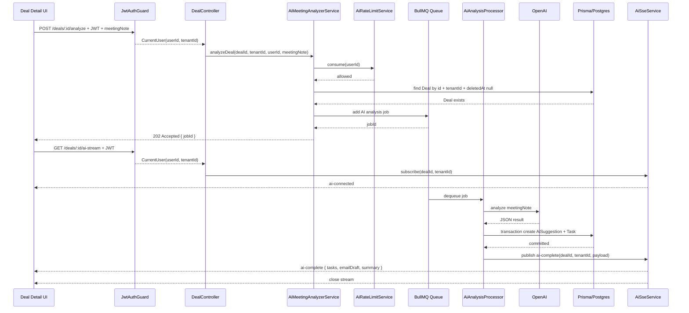
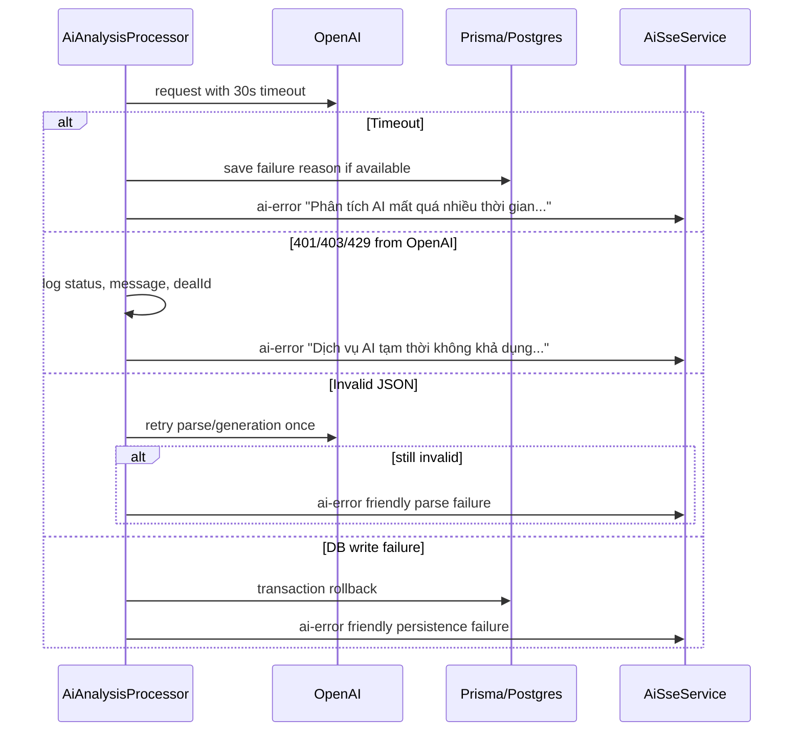
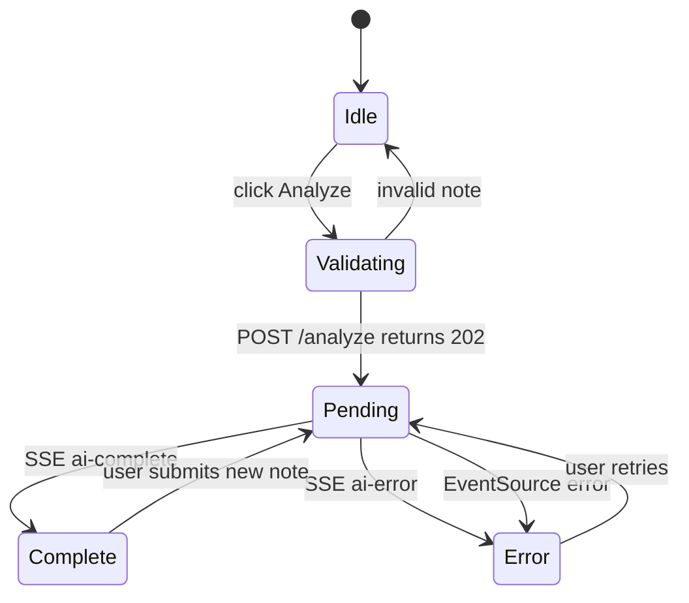

# Thiết kế: AI Meeting Note Analyzer

## Tổng quan

Tính năng **AI Meeting Note Analyzer** mở rộng Deal detail trong CRM SaaS để sales rep có thể paste ghi chú cuộc họp, gửi phân tích AI và nhận lại task list, email draft, summary theo thời gian thực.

Backend nhận request tại `POST /deals/:id/analyze`, validate input và tenant isolation, sau đó enqueue BullMQ job để xử lý nền. Worker gọi OpenAI, parse kết quả JSON, lưu `AiSuggestion`, tạo `Task`, rồi phát kết quả về các client đang subscribe Deal qua SSE tại `GET /deals/:id/ai-stream`.

Thiết kế giữ nguyên nguyên tắc multi-tenant hiện tại: `tenantId` luôn lấy từ JWT, không nhận từ request body, và mọi truy vấn Deal đều lọc theo `tenantId`.

### Phạm vi

- Submit meeting note để phân tích AI theo từng Deal
- Queue xử lý nền bằng BullMQ + Redis
- Gọi OpenAI model `gpt-4o-mini` hoặc model từ env
- Lưu kết quả vào `AiSuggestion` và tạo `Task`
- Stream kết quả realtime qua Server-Sent Events
- UI panel trên Deal detail page
- Rate limit 10 request/user/phút bằng Redis
- Error handling cho Redis, OpenAI timeout, quota/auth, parse JSON

### Ngoài phạm vi

- Chỉnh sửa task sinh bởi AI trong cùng luồng phân tích
- Gửi email thật từ email draft
- Chat AI nhiều lượt
- Vector search hoặc lưu embedding meeting note
- WebSocket; thiết kế dùng SSE vì luồng một chiều server-to-client là đủ

---

## Kiến trúc

### Luồng xử lý tổng thể



### Luồng lỗi chính



### Cấu trúc module đề xuất

Backend nên đặt phần AI trong module con dưới Deal để tận dụng `DealRepository` và route `/deals/:id/...`.

```
be/src/routes/deal/
├── deal.controller.ts
├── deal.service.ts
├── deal.repo.ts
├── deal.model.ts
├── deal.dto.ts
├── deal.module.ts
└── ai-analysis/
    ├── ai-analysis.dto.ts
    ├── ai-analysis.model.ts
    ├── ai-analysis.service.ts
    ├── ai-analysis.repo.ts
    ├── ai-analysis.processor.ts
    ├── ai-sse.service.ts
    ├── ai-rate-limit.service.ts
    ├── openai-analysis.service.ts
    └── ai-analysis.constants.ts
```

Frontend nên đặt component cạnh pipeline detail page:

```
fe/src/app/(dashboard)/pipeline/[id]/
├── page.tsx
└── _components/
    └── ai-meeting-note-panel.tsx

fe/src/services/
└── ai-analysis.service.ts

fe/src/types/
└── ai-analysis.ts
```

---

## Backend Components và Interfaces

### DealController extensions

`DealController` hiện đã dùng `@UseGuards(JwtAuthGuard)` ở class level. Thêm hai route mới trước route động nếu cần tránh conflict route.

```typescript
@Post(':id/analyze')
@HttpCode(HttpStatus.ACCEPTED)
analyzeDeal(
  @Param('id') dealId: string,
  @CurrentUser() user: AccessTokenPayload,
  @Body() body: AnalyzeMeetingNoteBodyType,
) {
  return this.aiAnalysisService.enqueueAnalysis({
    dealId,
    tenantId: user.tenantId,
    userId: user.userId,
    meetingNote: body.meetingNote,
  });
}

@Sse(':id/ai-stream')
streamAiResult(
  @Param('id') dealId: string,
  @CurrentUser() user: AccessTokenPayload,
) {
  return this.aiSseService.subscribe({
    dealId,
    tenantId: user.tenantId,
    userId: user.userId,
  });
}
```

### AiMeetingAnalyzerService

Điều phối request đồng bộ: validate Deal, rate limit, enqueue job, map lỗi Redis.

```typescript
type EnqueueAnalysisInput = {
  dealId: string;
  tenantId: string;
  userId: string;
  meetingNote: string;
};

class AiMeetingAnalyzerService {
  async enqueueAnalysis(input: EnqueueAnalysisInput): Promise<{ jobId: string }>;
}
```

Trách nhiệm:

- Kiểm tra Deal tồn tại bằng `dealId`, `tenantId`, `deletedAt: null`
- Gọi `AiRateLimitService.consume(userId)`
- Enqueue BullMQ job với payload đầy đủ
- Trả 202 nhanh, không chờ OpenAI
- Throw `ServiceUnavailableException` nếu Redis/BullMQ không enqueue được

### AiAnalysisProcessor

BullMQ worker xử lý bất đồng bộ.

```typescript
type AiAnalysisJob = {
  jobId: string;
  dealId: string;
  tenantId: string;
  userId: string;
  meetingNote: string;
};

type AiAnalysisResult = {
  tasks: Array<{ title: string; dueDate?: string | null }>;
  emailDraft: string;
  summary: string;
};

class AiAnalysisProcessor {
  async process(job: Job<AiAnalysisJob>): Promise<void>;
}
```

Trách nhiệm:

- Gọi `OpenAiAnalysisService.analyzeMeetingNote`
- Retry parse/generation thêm 1 lần khi response sai schema
- Lưu kết quả trong một transaction
- Publish `ai-complete` khi thành công
- Publish `ai-error` khi thất bại cuối cùng
- Log lỗi OpenAI với `statusCode`, `message`, `dealId`

### OpenAiAnalysisService

Đóng gói OpenAI SDK và prompt.

Prompt yêu cầu output chỉ là JSON hợp lệ:

```text
You are a CRM sales assistant. Analyze the meeting note and return only JSON:
{
  "tasks": [{ "title": "string", "dueDate": "ISO 8601 string or null" }],
  "emailDraft": "string",
  "summary": "string"
}
Rules:
- tasks must be concrete follow-up actions
- dueDate must be ISO 8601 if inferable, otherwise null
- emailDraft must be professional and ready to edit
- summary must be concise
```

OpenAI request:

- Model: `OPENAI_MODEL`, default `gpt-4o-mini`
- Timeout: 30 giây
- Response format: JSON object nếu SDK/model hỗ trợ
- Không gửi `tenantId`, token hoặc dữ liệu nhạy cảm ngoài nội dung cần phân tích

### AiAnalysisRepository

Tách Prisma writes khỏi processor.

```typescript
class AiAnalysisRepository {
  async saveAnalysisResult(input: {
    dealId: string;
    tenantId: string;
    jobId: string;
    sourceNote: string;
    result: AiAnalysisResult;
  }): Promise<AiAnalysisResult>;
}
```

Transaction phải tạo:

- `AiSuggestion` type `TASK_LIST`, content là JSON string của `tasks`
- `AiSuggestion` type `EMAIL_DRAFT`, content là email draft
- `AiSuggestion` type `SUMMARY`, content là summary
- `Task[]` từ `tasks`

Do model `Task` hiện chưa có `tenantId`, tenant isolation đi qua quan hệ `Deal`. Khi tạo task phải kiểm tra Deal bằng `dealId + tenantId` trước transaction hoặc dùng nested create qua Deal đã xác thực.

### AiSseService

Quản lý stream theo `tenantId:dealId`.

```typescript
type AiSseEvent =
  | { type: 'ai-connected'; data: { dealId: string } }
  | { type: 'heartbeat'; data: { now: string } }
  | { type: 'ai-complete'; data: AiAnalysisResult }
  | { type: 'ai-error'; data: { message: string; jobId?: string } };

class AiSseService {
  subscribe(input: { tenantId: string; dealId: string; userId: string }): Observable<MessageEvent>;
  publishComplete(tenantId: string, dealId: string, payload: AiAnalysisResult): void;
  publishError(tenantId: string, dealId: string, payload: { message: string; jobId?: string }): void;
}
```

Yêu cầu:

- Validate Deal trước khi mở stream
- Gửi `ai-connected` ngay khi subscribe
- Gửi heartbeat mỗi 15 giây
- Publish theo key `${tenantId}:${dealId}`
- Đóng stream sau `ai-complete` hoặc `ai-error`
- Cleanup subscriber khi client disconnect

### AiRateLimitService

Redis counter theo user.

```typescript
class AiRateLimitService {
  async consume(userId: string): Promise<void>;
}
```

Redis key:

```text
ai-analysis:rate-limit:user:{userId}
```

Thuật toán:

- `INCR` key mỗi request hợp lệ vào endpoint analyze
- Nếu value là 1 thì `EXPIRE 60`
- Nếu value > 10, đọc TTL và throw `TooManyRequestsException`
- Gắn header `Retry-After` ở exception/filter hoặc controller layer

---

## Frontend Design

### AI_MeetingNotePanel

Component được render trong Deal detail page `fe/src/app/(dashboard)/pipeline/[id]/page.tsx`.

State chính:

```typescript
type AiPanelState = {
  meetingNote: string;
  isSubmitting: boolean;
  jobId?: string;
  error?: string;
  result?: {
    tasks: Array<{ title: string; dueDate?: string | null }>;
    emailDraft: string;
    summary: string;
  };
  copied: boolean;
};
```

UI:

- Textarea nhập meeting note, hiển thị counter ký tự
- Button `Phân tích bằng AI`
- Skeleton section cho Tasks, Email draft, Summary khi pending
- Result section sau `ai-complete`
- Error alert sau `ai-error` hoặc connection error
- Button `Copy` ở email draft, feedback `Đã copy!` trong 2 giây

### Frontend flow



### EventSource lifecycle

- Chỉ mở EventSource sau khi `POST /analyze` trả 202
- Lưu reference để close thủ công
- Close ngay khi nhận `ai-complete`
- Close ngay khi nhận `ai-error`
- Close trong cleanup của React effect khi component unmount
- Khi connection error, close connection, show error và re-enable button

Lưu ý kỹ thuật: native `EventSource` không hỗ trợ custom Authorization header. Nếu frontend hiện dùng JWT trong local storage/header, cần một trong hai hướng:

- Ưu tiên: dùng cookie httpOnly cho auth để SSE request tự gửi credential
- Nếu app hiện chỉ dùng Bearer token: dùng `fetch-event-source` hoặc polyfill EventSource hỗ trợ headers

Thiết kế backend vẫn yêu cầu JWT hợp lệ trước khi mở stream.

---

## Data Models

### Prisma hiện có

`schema.prisma` đã có enum và model nền tảng:

```prisma
enum AiSuggestionType {
  TASK_LIST
  EMAIL_DRAFT
  SUMMARY
}

model Task {
  id        String   @id @default(cuid())
  dealId    String
  title     String
  done      Boolean  @default(false)
  dueDate   DateTime?
  createdAt DateTime @default(now())

  deal Deal @relation(fields: [dealId], references: [id], onDelete: Cascade)
}

model AiSuggestion {
  id         String           @id @default(cuid())
  dealId     String
  type       AiSuggestionType
  content    String
  sourceNote String?
  createdAt  DateTime         @default(now())

  deal Deal @relation(fields: [dealId], references: [id], onDelete: Cascade)
}
```

### Migration đề xuất

Để đáp ứng tracking `jobId` và lỗi cho SSE/audit, nên mở rộng `AiSuggestion` hoặc thêm bảng job status. Phương án ít xâm lấn:

```prisma
model AiSuggestion {
  id         String           @id @default(cuid())
  dealId     String
  type       AiSuggestionType
  content    String
  sourceNote String?
  jobId      String?
  createdAt  DateTime         @default(now())

  deal Deal @relation(fields: [dealId], references: [id], onDelete: Cascade)

  @@index([dealId])
  @@index([jobId])
}
```

Nếu cần lưu lỗi kể cả khi không có suggestion nào được tạo, thêm model riêng:

```prisma
model AiAnalysisJobLog {
  id        String   @id @default(cuid())
  jobId     String   @unique
  dealId    String
  userId    String
  status    String
  error     String?
  createdAt DateTime @default(now())
  updatedAt DateTime @updatedAt

  @@index([dealId])
}
```

### Zod schemas

```typescript
export const AnalyzeMeetingNoteBodySchema = z.object({
  meetingNote: z
    .string()
    .trim()
    .min(10, 'meetingNote phải có ít nhất 10 ký tự')
    .max(10000, 'meetingNote không được vượt quá 10000 ký tự'),
}).strict();

export const AnalyzeMeetingNoteResSchema = z.object({
  jobId: z.string().min(1),
});

export const AiAnalysisResultSchema = z.object({
  tasks: z.array(z.object({
    title: z.string().min(1),
    dueDate: z.string().datetime().nullable().optional(),
  })),
  emailDraft: z.string().min(1),
  summary: z.string().min(1),
});
```

---

## Correctness Properties

### Property 1: Analyze API trả nhanh và không gọi OpenAI đồng bộ

_For any_ `meetingNote` hợp lệ và Deal thuộc tenant hiện tại, `POST /deals/:id/analyze` phải enqueue job và trả HTTP 202 với `jobId` mà không chờ OpenAI hoàn tất.

**Validates: Requirements 1.1, 2.1**

### Property 2: Validation meetingNote

_For any_ request có `meetingNote` rỗng, dưới 10 ký tự hoặc trên 10000 ký tự, API phải trả HTTP 422 và không enqueue job.

**Validates: Requirements 1.2, 1.3**

### Property 3: Cross-tenant isolation

_For any_ Deal thuộc tenant A, user tenant B gọi analyze hoặc ai-stream với Deal đó phải nhận 404 và không thấy stream/kết quả.

**Validates: Requirements 1.4, 3.4**

### Property 4: Rate limit theo userId

_For any_ user gửi hơn 10 request analyze trong 60 giây, request thứ 11 phải trả 429 với `Retry-After`; user khác không bị ảnh hưởng bởi counter đó.

**Validates: Requirements 5.1, 5.2, 5.3, 5.4**

### Property 5: OpenAI result schema

_For any_ OpenAI response không parse được thành `{ tasks, emailDraft, summary }`, processor phải retry tối đa 1 lần trước khi đánh dấu job failed.

**Validates: Requirements 2.2, 2.6**

### Property 6: DB write atomic

_For any_ job thành công ở bước OpenAI, nếu tạo `AiSuggestion` hoặc `Task` thất bại, toàn bộ dữ liệu đã tạo trong job đó phải rollback.

**Validates: Requirements 2.3, 2.4, 2.8**

### Property 7: Invalid dueDate không làm fail job

_For any_ task AI trả về có `dueDate` không phải ISO 8601, task vẫn được tạo với `dueDate = null` và job không bị fail vì riêng lỗi này.

**Validates: Requirements 2.4**

### Property 8: SSE lifecycle

_For any_ stream hợp lệ, server phải gửi `ai-connected` ngay sau khi mở, heartbeat mỗi 15 giây, và đóng stream sau `ai-complete` hoặc `ai-error`.

**Validates: Requirements 3.5, 3.6, 3.7**

### Property 9: SSE publish đúng Deal

_For any_ job hoàn tất của Deal X, chỉ subscriber cùng `tenantId` và `dealId` của Deal X được nhận `ai-complete` hoặc `ai-error`.

**Validates: Requirements 3.2, 3.3, 3.4**

### Property 10: Frontend không submit trùng

_For any_ lần phân tích đang pending, AI panel phải disable nút phân tích và không gửi request analyze thứ hai cho đến khi nhận complete/error.

**Validates: Requirements 4.2, 4.8**

---

## Xử lý lỗi

| Tình huống | HTTP/SSE | Message |
| --- | --- | --- |
| Thiếu hoặc JWT không hợp lệ | HTTP 401 | Unauthorized |
| Deal không tồn tại hoặc khác tenant | HTTP 404 | Deal không tồn tại |
| `meetingNote` không hợp lệ | HTTP 422 | Thông báo rõ trường và giới hạn |
| Vượt 10 request/phút | HTTP 429 | `Bạn đã vượt quá giới hạn 10 lần phân tích/phút. Vui lòng thử lại sau.` |
| Redis/BullMQ không enqueue được | HTTP 503 | Dịch vụ phân tích AI tạm thời không khả dụng |
| OpenAI timeout 30 giây | SSE `ai-error` | `Phân tích AI mất quá nhiều thời gian. Vui lòng thử lại.` |
| OpenAI quota/auth 401/403/429 | SSE `ai-error` | `Dịch vụ AI tạm thời không khả dụng. Vui lòng liên hệ admin.` |
| OpenAI JSON sai sau retry | SSE `ai-error` | Không thể phân tích ghi chú. Vui lòng thử lại. |
| DB transaction thất bại | SSE `ai-error` | Không thể lưu kết quả phân tích. Vui lòng thử lại. |
| EventSource lỗi kết nối | Frontend UI | Mất kết nối khi chờ kết quả AI. Vui lòng thử lại. |

### Logging

- Log lỗi OpenAI ở mức `error`, gồm `statusCode`, `message`, `dealId`, `jobId`
- Không log toàn bộ `meetingNote` nếu có khả năng chứa dữ liệu nhạy cảm
- Log Redis enqueue failure với queue name và reason
- Log DB transaction failure với `dealId`, `jobId`

---

## Cấu hình môi trường

Biến môi trường bắt buộc:

```env
OPENAI_API_KEY=
REDIS_HOST=
REDIS_PORT=
```

Biến môi trường tùy chọn:

```env
OPENAI_MODEL=gpt-4o-mini
```

Validation bằng Zod khi boot app:

- Thiếu `OPENAI_API_KEY`, `REDIS_HOST`, `REDIS_PORT` thì log rõ biến thiếu và dừng process với exit code khác 0
- `REDIS_PORT` phải parse được thành số hợp lệ
- `OPENAI_MODEL` default `gpt-4o-mini`

---

## Chiến lược kiểm thử

### Backend unit/integration tests

- `POST /deals/:id/analyze` hợp lệ trả 202 và `jobId`
- Validation `meetingNote` trả 422 cho rỗng, dưới 10 ký tự, trên 10000 ký tự
- Thiếu JWT trả 401
- Deal khác tenant trả 404
- Redis enqueue failure trả 503
- Rate limit request thứ 11 trả 429 và có `Retry-After`
- Processor parse OpenAI response hợp lệ và gọi repository lưu kết quả
- Processor retry 1 lần khi JSON sai schema
- Processor timeout 30 giây publish `ai-error`
- Repository transaction rollback khi tạo `Task` hoặc `AiSuggestion` thất bại
- SSE gửi `ai-connected`, heartbeat, `ai-complete`, `ai-error`, và complete observable sau final event

### Frontend tests

- Render textarea, counter, button phân tích
- Disable button khi pending
- Không submit nếu note dưới 10 ký tự hoặc quá 10000 ký tự
- Mock POST 202 và SSE `ai-complete`, assert render tasks/email/summary
- Mock SSE `ai-error`, assert hiển thị lỗi và re-enable button
- Mock EventSource error, assert close connection
- Copy email draft hiển thị `Đã copy!` trong 2 giây

### Property-based tests

Sử dụng `fast-check` cho các invariant quan trọng:

- Meeting note length boundary
- Rate limit counter theo `userId`
- Cross-tenant isolation cho analyze/stream
- Invalid `dueDate` mapping về `null`
- SSE event chỉ publish đúng `tenantId:dealId`

