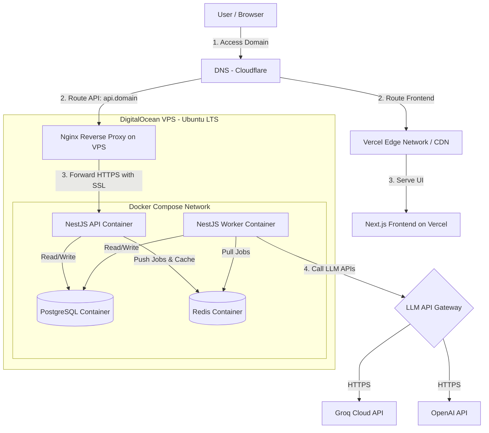
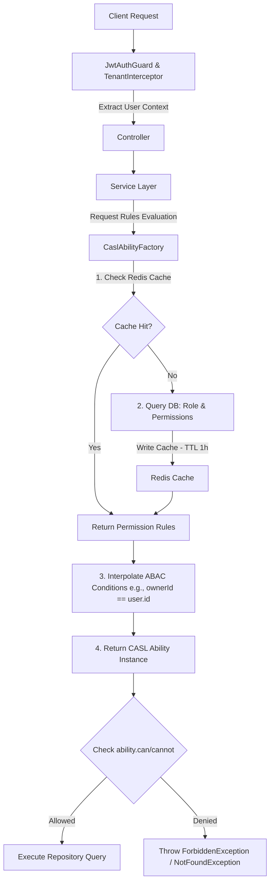
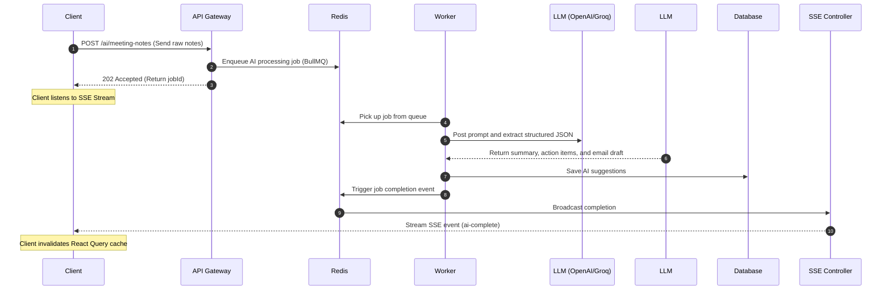
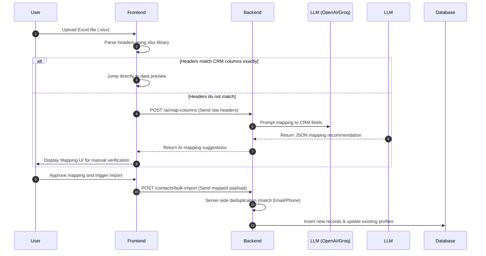

# CRM SaaS - Intelligent Customer Management Platform for SMEs

<div align="center">

[](https://react.dev/)
[](https://nextjs.org/)
[](https://tailwindcss.com/)
[](https://nestjs.com/)
[](https://prisma.io/)
[](https://redis.io/)
[](https://www.postgresql.org/)
[](https://openai.com/)
[](https://groq.com/)

</div>

---

A production-grade, multi-tenant Customer Relationship Management (CRM) SaaS platform designed for Small and Medium Enterprises (SMEs). This system features a visual drag-and-drop Sales Pipeline (Kanban), activity tracking, a granular RBAC/ABAC security system, audit trails, and deep Generative AI integrations (via OpenAI and Groq APIs) to automate meeting note summarization, follow-up emails, and unstructured database imports.

**Demo Video:** [https://youtu.be/JAUMLhuh9cM](https://youtu.be/JAUMLhuh9cM)  
**Live Demo:** [https://codelaicuocdoi.io.vn](https://codelaicuocdoi.io.vn)  
👥 **Test Accounts:**
*   **Tenant 1 (Admin):** `admin@abc.com` / Password: `Password123!`
*   **Tenant 1 (Sales Rep):** `sales@abc.com` / Password: `Password123!`
*   **Tenant 2 (Admin):** `admin1@abc.com` / Password: `Password123!`

---

## 📸 Core Interface & Visual Features

| **Analytics Dashboard** | **Reports & Statistics** |
| --- | --- |
|  |  |
| *Visual analytics tracking deals value, win rates, and team performance.* | *Conversion funnel tracking and sales activity distribution.* |

| **Kanban Board for Deal Pipeline** | **AI Meeting Brief & Action Items** |
| --- | --- |
|  |  |
| *Smooth drag-and-drop interface for updating deal stages.* | *Asynchronous AI parsing of raw meeting notes to extract deliverables.* |

| **Permissions & Multi-Tenant Configuration** |
| --- |
|  |
| *Matrix-based dynamic permission management with system and custom roles.* |

---

## 🏗️ Production Deployment Architecture

The platform uses a **Hybrid Infrastructure** model to optimize frontend loading speeds, database performance, and operational costs.



### Infrastructure Trade-offs

1.  **Vercel (FE) + VPS Docker Compose (BE)** vs. **Fully Serverless/AWS (ECS/RDS/ElastiCache)**:
    *   *Why Chosen:* Running a full enterprise stack on AWS (Application Load Balancers, ECS Fargate, RDS Multi-AZ, and ElastiCache) can easily cost over $100/mo. By deploying Next.js to Vercel (free global CDN, edge execution) and self-hosting the backend, database, and cache on a single $12/mo DigitalOcean VPS, we achieve massive cost savings while maintaining production-grade APIs.
    *   *Trade-off (SPOF & Scalability):* The VPS acts as a single point of failure (SPOF) for the database and cache. We mitigate this using automated nightly PostgreSQL snapshots and local host directory volume mounts. If application traffic scales out, we can migrate the Docker stack to a managed service with minimal configuration changes.

2.  **Nginx Reverse Proxy & Certbot** vs. **Cloud Load Balancers**:
    *   *Why Chosen:* Nginx acts as our edge proxy directly on the Ubuntu server, terminating SSL/TLS certificates generated by Let's Encrypt (Certbot).
    *   *Trade-off:* Standard load balancers auto-scale and manage failover. Nginx on VPS requires manual performance tuning (worker connections, buffer sizes) and does not automatically support cross-node failover.

---

## 🛠️ Detailed Tech Stack & Rationale

### Frontend (`/fe`)

*   **Next.js 15 (App Router) & React 19**: Selected for server-side rendering (SSR), search engine optimization (SEO), and unified routing. React 19 handles fast UI updates and integrates with modern state paradigms.
*   **Tailwind CSS v4 & Shadcn UI (Radix UI)**: Tailwind CSS v4 delivers a compiled utility-first styling pipeline. Shadcn UI provides unstyled, accessible primitives that allow us to customize the visual system without importing bloated component libraries.
*   **Zustand**: Used as a lightweight global client state store. It provides a simple API without the boilerplates of Redux, avoiding unnecessary re-renders.
*   **TanStack Query (React Query) v5**: Acts as the asynchronous server state sync layer. It handles query caching, query deduplication, background data re-fetching, and optimistic mutations for instant UI responses.
*   **`@dnd-kit`**: Handles the drag-and-drop functionality on the Deal Pipeline Kanban board. It supports clean layouts, customizable modifiers, and screen reader/touch navigation.

### Backend (`/be`)

*   **NestJS 11**: Provides an architectural structure (Modules, Controllers, Services, Guards) with native TypeScript support, enabling developers to build clean, maintainable backend code.
*   **Prisma ORM v7 & PostgreSQL**: PostgreSQL guarantees strict relational data integrity. Prisma provides type safety, autogenerated SQL migrations, and query extensions that enforce system-wide tenant scoping.
*   **BullMQ & Redis**: Redis acts as the message queue broker and caching layer. BullMQ is a robust queue manager used to process long-running, CPU-intensive LLM requests asynchronously.
*   **Server-Sent Events (SSE)**: SSE streams the state of background AI processing to the client. This replaces client-side HTTP polling, reducing resource consumption on the server.
*   **Multi-Provider AI Client (OpenAI & Groq)**: Built on the OpenAI SDK. It enables switching between OpenAI's logical models (`gpt-4o-mini`) and Groq's high-speed engines (`llama-3.3-70b-versatile`) depending on target latency requirements.

---

## 🛡️ Key Architectural Implementations

### 1. Data Isolation in the Multi-Tenant Model

In a shared-database, shared-schema SaaS model, accidental cross-tenant data leakage is a critical vulnerability.

```
Client HTTP Request (Header: JWT)
        │
        ▼
[Tenant Context Interceptor/Guard]
        │
        ▼
[Extract tenantId & Set AsyncLocalStorage context]
        │
        ▼
[Prisma Query Extension] (Auto-appends `where: { tenantId }` filters)
        │
        ▼
[PostgreSQL Database] (Strictly isolated query execution)
```

*   **Implementation:** We implement automatic query scoping using **Prisma Query Extensions**. When a request passes through the `TenantInterceptor`, the `tenantId` is extracted from the JWT token and stored in a Node.js `AsyncLocalStorage` context. The Prisma client interceptor automatically injects `where: { tenantId }` parameters into all incoming database queries.
*   **Trade-off:**
    *   *Logical Isolation vs. Physical Isolation:* Using a single database for all tenants is highly cost-effective and simplifies schema migrations. However, a developer database query bypass or bug could leak data. We address this risk by enforcing isolation at the client extension level rather than relying on developer discipline.

### 2. Dynamic RBAC & ABAC (Access Control)

The system supports standard Role-Based Access Control (RBAC) alongside Attribute-Based Access Control (ABAC) to enforce fine-grained data ownership.



*   **Implementation:** Permissions are defined dynamically in the database via the `Role`, `Permission`, and `RolePermission` tables. We use **CASL** to evaluate complex rules. ABAC constraints (such as allowing a sales rep to only view deals they own) are defined as JSON structures (e.g. `{"ownerId": "${user.id}"}`) in the database.
*   **Redis Caching & Invalidation:** Querying the database for permission rules on every request adds overhead. To solve this, user ability schemas are cached in Redis under `tenant:<tenantId>:role:<roleName>:permissions` with a 1-hour TTL. Any updates to a workspace role trigger an automatic cache invalidation using `invalidateRoleCache()`.
*   **Trade-off:**
    *   *Dynamic Rules vs. Hardcoded Roles:* Building dynamic permissions requires complex database schemas and caching mechanisms. However, it gives enterprise tenants the flexibility to build custom roles and matrix permissions directly from the frontend UI.

### 3. Asynchronous AI Job Processing

Calling LLM APIs synchronously inside web requests blocks the server's event loop and can cause HTTP timeout errors (such as Vercel's 10-second limit).



*   **Implementation:** The API Gateway accepts AI requests and immediately queues a background job via **BullMQ/Redis**, returning an HTTP `202 Accepted` status along with a `jobId`. A separate background worker process handles the LLM API calls. Once complete, results are stored in the database, and a completion event is pushed to the client using **Server-Sent Events (SSE)**.
*   **Trade-off:**
    *   *Operational Overhead vs. Application Resilience:* Setting up Redis and running a background worker process increases infrastructure complexity. However, it makes the platform highly resilient, prevents request timeout errors, and allows the API Gateway to scale independently.

### 4. Bulk Import & AI Column Mapping

This feature allows non-technical users to migrate data from unstructured Excel files without forcing them to conform to a rigid, hardcoded CSV template.



*   **Implementation:** The client parses uploaded Excel files using the `xlsx` library and extracts the headers. The frontend sends these headers to the `/ai/map-columns` API endpoint. The LLM maps unstructured user headers to standard CRM system fields and returns a clean JSON schema. The user can review the mapping on the frontend UI before confirming the import.
*   **Trade-off:**
    *   *AI Cost & Latency vs. Rigid Templates:* LLM schema mapping costs API tokens and adds a 1-2 second latency. We minimize this overhead by running local client-side checks to see if headers match system fields exactly, only querying the LLM when there are mismatched headers.

### 5. Structured Audit Logging

To maintain transparency and auditability in enterprise CRM spaces, changes to critical business records must be logged securely.

*   **Implementation:** Write operations targeting the `DEAL` and `CONTACT` entities trigger the `AuditLogsService`. It compares the record's current state with its incoming state to compute a JSON Diff (e.g. tracking changes to the deal stage from `PROPOSAL` to `CLOSED_WON`). Logs are saved to the `AuditLog` table using cursor-based pagination, allowing administrators to retrieve records efficiently.
*   **Trade-off:**
    *   *Primary Database Storage vs. Log Stashes:* Storing unstructured audit logs directly in PostgreSQL increases database size. However, it keeps our infrastructure footprint small and ensures that database transactions and logging operations occur synchronously.

---

## 📖 API Documentation (Swagger)

The API is fully documented using **Swagger (OpenAPI)**, allowing developers to inspect endpoints, request payloads, and response structures.

*   **Live Endpoint:** [https://api.codelaicuocdoi.io.vn/api-docs](https://api.codelaicuocdoi.io.vn/api-docs)
*   **Features:**
    *   **Auto-generated Schemas:** Data schemas are automatically generated from Zod DTOs using the `nestjs-zod` plugin.
    *   **Interactive Auth Support:** Developers can test protected endpoints by providing an `accessToken` cookie or an HTTP `Bearer` token directly in the browser UI. The sessions persist across page reloads using the Swagger `persistAuthorization` config.
    *   **Structured Resource Groups:** Endpoints are organized into clean API modules: *Auth, Contacts, Deals, Activities, Users, Invitations, Dashboard, Reports, and Audit Logs*.

---

## 📝 License & Terms
All rights reserved. This software and its source code are proprietary. 
No part of this project may be copied, modified, distributed, or published (including hosting public forks outside of GitHub) without the explicit, prior written permission of the author.
*For inquiries, permissions, or developer discussions, contact:* `nguyenthuan05.work@gmail.com`